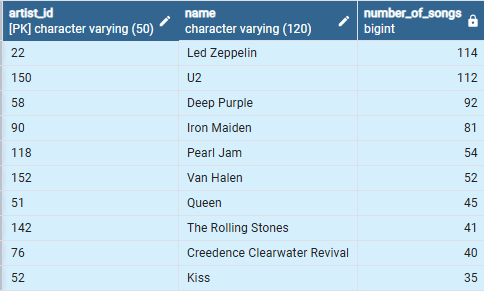

# Music-Database-Explorer
## Music Data Analysis with PostgreSQL
### This guided project uses PostgreSQL to analyze music datasets containing artists, albums, genres, customers purchasing history and listening activity, etc. to help generate meaningful insights through SQL queries. 

## Music Database Schema:

## Features:
1. Stored and managed structured music datasets in PostgreSQL.
2. Analyzed customer spending on artists country wise, popular music genre for each country, listening trends like longest song played with SQL queries.
3. Example Insights: 
   a) 'Best City' in terms of most money spent by customers to throw a music festival in that city. 
   b) Top 10 Artists who have written most 'Rock Music' in our dataset. 
   c) Most popular 'Music Genre' for each country. 
   
## Example Query:
### Let's invite the artists who have written the most rock music in our dataset. Write a query that returns the Artist name and total track count of the top 10 rock bands.

   SELECT ar.artist_id, ar.name, COUNT(ar.artist_id) AS number_of_songs 
   FROM track AS t 
   JOIN album AS a 
   ON a.album_id = t.album_id 
   JOIN artist AS ar 
   ON ar.artist_id = a.artist_id 
   JOIN genre AS g 
   ON g.genre_id = t.genre_id 
   WHERE g.name LIKE 'Rock' 
   GROUP BY ar.artist_id 
   ORDER BY number_of_songs DESC 
   LIMIT 10; 

### Generated Result:   

   
   
